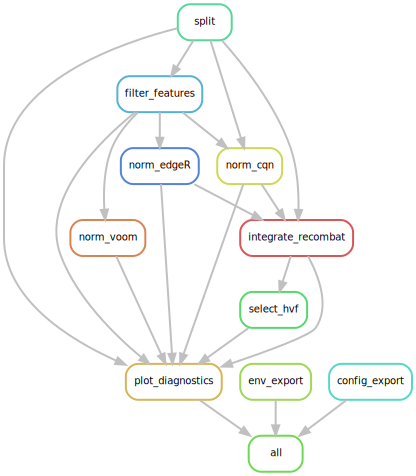

 

#  <ins>Sp</ins>lit, F<ins>ilter</ins>, Norma<ins>lize</ins> and <ins>Integrate</ins> Sequencing Data
A [Snakemake 8](https://snakemake.readthedocs.io/en/stable/) workflow to split, filter, normalize, integrate and select highly variable features of count matrices resulting from experiments with sequencing readout (e.g., RNA-seq, ATAC-seq, ChIP-seq, Methyl-seq, miRNA-seq, ...) including confounding factor analyses and diagnostic visualizations informing and documenting the respective data transformations. This often represents the first analysis after signal processing, critically influencing all downstream analyses.

> [!NOTE]  
> This workflow adheres to the module specifications of [MrBiomics](https://github.com/epigen/MrBiomics), an effort to augment research by modularizing (biomedical) data science. For more details, instructions, and modules check out the project's repository.
>
> ⭐️ **Star and share modules you find valuable** 📤 - help others discover them, and guide our focus for future work!

> [!IMPORTANT]  
> **If you use this workflow in a publication, please don't forget to give credit to the authors by citing it using this DOI [10.5281/zenodo.8144219](https://doi.org/10.5281/zenodo.8144219).**

# 🖋️ Authors
- [Stephan Reichl](https://github.com/sreichl)
- [Christoph Bock](https://github.com/chrbock)

# 💿 Software
This project wouldn't be possible without the following software and their dependencies.

| Software | Reference (DOI) |
| :---: | :---: |
| ComplexHeatmap | https://doi.org/10.1093/bioinformatics/btw313     |
| CQN            | https://doi.org/10.1093/biostatistics/kxr054      |
| edgeR          | https://doi.org/10.1093/bioinformatics/btp616     |
| fastcluster    | https://doi.org/10.18637/jss.v053.i09             |
| ggplot2        | https://ggplot2.tidyverse.org/                    |
| _limma_        | https://doi.org/10.1093/nar/gkv007                |
| matplotlib     | https://doi.org/10.1109/MCSE.2007.55              |
| pandas         | https://doi.org/10.5281/zenodo.3509134            |
| patchwork      | https://CRAN.R-project.org/package=patchwork      |
| reshape2       | https://doi.org/10.18637/jss.v021.i12             |
| scikit-learn   | http://jmlr.org/papers/v12/pedregosa11a.html      |
| seaborn        | https://doi.org/10.21105/joss.03021               |
| Snakemake      | https://doi.org/10.12688/f1000research.29032.2    |
| statsmodels    | https://www.statsmodels.org/stable/index.html#citation   |
| TMM            | https://doi.org/10.1186/gb-2010-11-3-r25          |

# 🔬 Methods
This is a template for the Methods section of a scientific publication and is intended to serve as a starting point. Only retain paragraphs relevant to your analysis. References `[ref]` to the respective publications are curated in the software table above. Versions `(ver)` have to be read out from the respective conda environment specifications (`workflow/envs/*.yaml` file) or post execution in the result directory (`spilterlize_integrate/envs/*.yaml`). Parameters that have to be adapted depending on the data or workflow configurations are denoted in squared brackets e.g., `[X]`.

__Split.__ The input data was split by `[split_by]`, with each split denoted by `[split_by]_{annotation_level}`. The complete data was retained in the "all" split. Sample filtering was achieved by removing sample rows from the annotation file or using `NA` in the respective annotation column. Annotations were also split and provided separately. The data was loaded, split, and saved using the Python library pandas `(ver)[ref]`.

__All downstream analyses were performed for each split separately.__

__Filter.__ The features were filtered using the `filterByExpr` function from the R package edgeR`(ver)[ref]`. The function was configured with the following parameters: `group` set to `[group]`, `min.count` to `[min.count]`, `min.total.count` to `[min.total.count]`, `large.n` to `[large.n]`, and `min.prop` to `[min.prop]`. The number of features was reduced from `[X]` to `[X]` by filtering.

__Normalize.__ Normalization of the data was performed to correct for technical biases. 

The CalcNormFactors function from the R package edgeR`(ver)[ref]` was used to normalize the data using the `[edgeR_parameters.method]` method with subsequent `[edgeR_parameters.quantification]` quantification. The parameters used for this normalization included `[edgeR_parameters]`.

Conditional Quantile Normalization (CQN) was performed using the R package cqn`(ver)[ref]`. The parameters used for this normalization included `[cqn_parameters]`.

The VOOM method from the R package limma`(ver)[ref]` was used to estimate the mean-variance relationship of the log-counts and generate a precision weight for each observation. The parameters used for this normalization included `[voom_parameters]`. 

The normalization results were log2-normalized for downstream analyses.

__Integrate.__ The data integration was performed using `limma`'s `removeBatchEffect` method`(ver)[ref]` and applied to the log-normalized data. This method adjusts for batch effects and unwanted sources of variation while retaining desired (e.g., biological) variability. The following effects were modeled within the integration: desired variation `[desired]` was retained, while unwanted variation `[unwanted_categorical]` and `[unwanted_numerical]` were removed.

__Highly Variable Feature (HVF) selection.__ Highly variable features (HVF) were selected based on the binned normalized dispersion of features adapted from [Zheng (2017) Nature Communications](https://doi.org/10.1038/ncomms14049). The top `[hvf_parameters.top_percentage]` percent of features were selected, resulting in `[X]` features. The dispersion for each feature across all samples was calculated as the standard deviation. Features were binned based on their means, and the dispersion of each feature was normalized by subtracting the median dispersion of its bin and dividing by the median absolute deviation (MAD) of its bin using the Python package statsmodels `(ver)[ref]`. The number of bins used for dispersion normalization was `[hvf_parameters.bins_n]`. The selected HVFs were visualized by histograms before and after normalization, mean to normalized dispersion scatterplots, and a scatterplot of the ranked normalized dispersion, always highlighting the selected features.

__Confounding Factor Analysis (CFA).__ We assessed potential confounding effects of metadata on principal components (PCs) by quantifying their statistical associations with the first ten PCs from principal component analysis (PCA) and evaluated pairwise statistical associations among metadata using Kendall's Tau correlation for continuous-continuous comparisons, Kruskal-Wallis tests for continuous-categorical comparisons, and Fisher's exact tests using Monte Carlo simulation (B = 10,000) to compute P-values in reasonable time, for categorical-categorical comparisons, with p-values adjusted via the Benjamini-Hochberg method. Metadata without variation were excluded, and numeric metadata with fewer than 25 unique values were converted to factors. The results were visualized as a heatmap with hierarchically clustered rows (metadata) displaying -log10 adjusted p-values, distinguishing between numeric and categorical metadata.

__Correlation Heatmaps.__ To assess sample similarities we generated heatmaps of the sample-wise Pearson correlation matrix. using the `cor` function in R with the "pearson" method. Two versions of heatmaps were created: one hierarchically clustered and one sorted alphabetically by sample name. Hierarchical clustering was performed with the `hclust` function from the `fastcluster` package [ver] using "euclidean" distance and "complete" linkage. Heatmaps were visualized using the `ComplexHeatmap` package [ver] and annotated with relevant metadata.

__Visualization.__ The quality of the data and the effectiveness of the processing steps were assessed through the following visualizations (raw/filtered counts were log2(x+1)-normalized): the mean-variance relationship of all features, densities of log2-values per sample, boxplots of log2-values per sample, and Principal Component Analysis (PCA) plots. For the PCA plots, features with zero variance were removed beforehand and colored by `[visualization_parameters.annotate]`. The plots were generated using the R libraries ggplot2, reshape2, and patchwork`(ver)[ref]`.

**The analyses and visualizations described here were performed using a publicly available Snakemake `[ver](ref)` workflow `(ver)` [10.5281/zenodo.8144219](https://doi.org/10.5281/zenodo.8144219).**

# 🚀 Features
The workflow performs the following steps to produce the outlined results:

- Split (`{annotation_column}_{annotation_level}/counts.csv`)
  - The input data is split according to the levels of the provided annotation column(s), and all downstream steps are performed for each split separately.
  - Each split is denoted by `{annotation_column}_{annotation_level}`.
  - The complete input data is retained in the split `all`.
  - Note: splits are performed solely based on the provided annotations, arbitrarily complex splits are possible as long as they are reflected in the annotations.
  - Sample filtering (e.g., QC) can be achieved within...
    - ...`all` by removing the sample rows from the annotation file.
    - ...`splits` by using NA in the respective annotation column.
  - Annotations are also split and provided separately (`{annotation_column}_{annotation_level}/annotation.csv`).
- Filter (`filtered.csv`)
  - The features are filtered using the edgeR package's [filterByExpr](https://rdrr.io/bioc/edgeR/man/filterByExpr.html) function, which removes low-count features that are unlikely to be informative but likely to be statistically problematic downstream.
  - The `min.count` parameter has the biggest impact on the filtering process, while `min.total.count` does not.
  - **min.count** is based on actual raw counts, not CPM ([bioconductor](https://support.bioconductor.org/p/9141963/)).
  - The **CPM cutoff** is calculated as `cpm_cutoff = min.count / medianLibSize * 1e6`, using the **median library size** for normalization ([biostars](https://www.biostars.org/p/9538555/)).
  - **min.count.total** operates purely only to raw counts, ignoring CPM or other normalization factors like library size, which is consistent with how raw counts are handled in filtering.
  - The desired number of features depends on the data and assay used, below are some examples that provide a ballpark estimate based on previous experiences (feel free to ignore).
    - Generally, you should filter until the mean-variance plot shows a consistent downward trend, with no upward trend at the low-expression end (left).
    - RNA-seq, when starting with 55k genes it is not uncommon to end up with ~15k genes or less post-filtering.
    - ATAC-seq consensus regions scale with the number of samples. Nevertheless, we had good experiences with ~100k genomic regions post-filtering.
- Normalize (`norm{method}.csv`)
  - The data can be normalized using several methods to correct for technical biases (e.g., differences in library size).
  - All methods supported in edgeR's function [CalcNormFactors](https://rdrr.io/bioc/edgeR/man/calcNormFactors.html) with subequent [CPM/RPKM](https://rdrr.io/bioc/edgeR/man/cpm.html) quantification including method specific parameters can be configured.
  - [CQN](https://bioconductor.org/packages/release/bioc/html/cqn.html) (Conditional Quantile Normalization) corrects for a covariate (e.g., GC-content) and feature-length biases (e.g., gene length). The QR fit of the covariate and feature-length are provided as plots (`normCQN_QRfit.png`).
  - [VOOM](https://rdrr.io/bioc/limma/man/voom.html) (Mean-Variance Modeling at the Observational Level) from the package limma estimates the mean-variance relationship of the log counts and generates a precision weight for each observation. The Mean-Variance trend plot is provided (`normVOOM_mean_variance_trend.png`).
  - All normalization outputs are log2-normalized.
- Integrate (`*_integrated.csv`)
  - The data can be integrated using the [limma's removeBatchEffect](https://rdrr.io/bioc/limma/man/removeBatchEffect.html) function, which requires log-normalized data as input.
  - This method adjusts for batch effects and unwanted sources of variation while trying to retain desired sources of variation e.g., biological variability.
  - This is particularly useful when combining data from different experiments or sequencing runs.
  - Use as few variables as possible for the (un)wanted parameters, as they often correlate (e.g., sequencing statistics) and can dilute the model's predictive/corrective power across multiple variables. The effects are assumed to be additive.
   - For unwanted sources of variation, start with the strongest confounder (see Confounding Factor Analysis below); this is often sufficient.
   - For desired sources of variation, combine all relevant metadata into a single column (e.g., `condition`) and use only this.
   - Note: Output is not intended to be used for linear modelling. For linear modelling, it is better to include the covariates in the linear model. The output provides intuition how the downstream analyses such as linear modeling using limma given the same design, "see" the data. The output should be used e.g., for unsupervised analyses.
- Highly Variable Feature Selection (`*_HVF.csv`)
  - The top percentage of the most variable features is selected based on the binned normalized dispersion of each feature adapted from [Zheng (2017) Nature Communications](https://doi.org/10.1038/ncomms14049).
  - These HVFs are often the most informative for downstream analyses such as clustering or differential expression, but smaller effects of interest could be lost.
  - The selection is visualized by histograms before and after normalization, mean to normalized dispersion scatterplots, and a scatterplot of the ranked normalized dispersion always highlighting the selected features (`*_HVF_selection.png`).
- Results (`{split}/*.csv`)
  - All transformed datasets are saved as CSV files and named by the applied methods, respectively.
  - Example: `{split}/normCQN_integrated_HVF.csv` implies that the respective data `{split}` was filtered, normalized using CQN, integrated and subset to its HVFs.
- Visualizations (`{split}/plots/`)
  - Next to the method-specific visualizations (e.g., for CQN, HVF selection), a **diagnostic figure** is provided for every generated dataset (`*.png`), consisting of the following plots:
    - Mean-Variance relationship of all features as a hexagonal heatmap of 2d bin counts.
    - Densities of log-normalized counts per sample colored by sample or configured annotation column.
    - Boxplots of log-normalized counts per sample colored by sample or configured annotation column.
    - Principal Component Analysis (PCA) plots, with samples colored by up to two annotation columns (e.g., batch and treatment).
  - Confounding Factor Analysis to inform integration and downstream modeling (`*CFA.png`)
    - Quantification of statistical association among metadata (`CFA.png`) and between provided metadata and (up to) the first ten principal components (`*_CFA.png`).
    - Categorical-categorical associations are tested using Fisher's exact test, which is suitable for small sample sizes/low cell counts (e.g., 3 replicates per condition). P-values were computed using Monte Carlo simulation (B = 10,000) for efficiency.
    - Categorical-continuous associations are tested using the non-parametric Kruskal-Wallis test, which is broadly applicable due to relaxed requirements and assumptions.
    - Continuous-continuous associations are tested using rank-based Kendall's Tau correlation, which is suitable for "small" data sets with many ties and is robust to outliers.
    - Statistical associations as `-log10(adjusted p-values)` are visualized using a heatmap with hierarchically clustered rows (metadata).
  - Correlation Heatmaps (`*_heatmap_{clustered|sorted}.png`)
    - Heatmap of sample-wise Pearson correlation matrix of the respective data split and processing step to quickly assess sample similarities e.g., replicates/conditions should correlate highly but batch shoud not.
    - Hierarchically clustered using method 'complete' with distance metric 'euclidean' (`*_heatmap_clustered.png`).
    - Alphabetically sorted by sample name (`*_heatmap_sorted.png`).
  - Note: raw and filtered counts are log2(x+1)-normalized for the visualizations.
  - These visualizations should help to assess the quality of the data and the effectiveness of the processing steps (e.g., normalization).
  - Visualizations are within each split's plots subfolder, with the identical naming scheme as the respective data.

# 🛠️ Usage
Here are some tips for the usage of this workflow:
- Don't be scared off by the number of configurable parameters, the goal was to enable maximum configurability, hence the `config.yaml` is quite comprehensive.
- Start with defaults, which are provided.
- Use a minimum of options and configuration changes at the beginning until the workflow is running, then start to adapt.
- Use the diagnostic visualizations to understand the effect different methods and parameter combinations have on your data.

# ⚙️ Configuration
Detailed specifications can be found here [./config/README.md](./config/README.md)

# 📖 Examples
--- COMING SOON ---

# 🔗 Links
- [GitHub Repository](https://github.com/epigen/spilterlize_integrate/)
- [GitHub Page](https://epigen.github.io/spilterlize_integrate/)
- [Zenodo Repository](https://doi.org/10.5281/zenodo.8144219)
- [Snakemake Workflow Catalog Entry](https://snakemake.github.io/snakemake-workflow-catalog?usage=epigen/spilterlize_integrate)

# 📚 Resources
- Recommended compatible [MrBiomics](https://github.com/epigen/MrBiomics) modules
  - for upstream processing:
    - [ATAC-seq Processing](https://github.com/epigen/atacseq_pipeline) to quantify chromatin accessibility into count matrices as input.
    - [scRNA-seq Data Processing & Visualization](https://github.com/epigen/scrnaseq_processing_seurat) for processing (multimodal) single-cell transcriptome data. and creating pseudobulked count matrices as input.
  - for downstream analyses:
    - [Unsupervised Analysis](https://github.com/epigen/unsupervised_analysis) to understand and visualize similarities and variations between cells/samples, including dimensionality reduction and cluster analysis. Useful for all tabular data including single-cell and bulk sequencing data.
    - [Differential Analysis with limma](https://github.com/epigen/dea_limma) to identify and visualize statistically significantly different features (e.g., genes or genomic regions) between sample groups.
    - [Enrichment Analysis](https://github.com/epigen/enrichment_analysis) for biomedical interpretation of (differential) analysis results using prior knowledge.
- [Bioconductor - RNAseq123 - Workflow](https://bioconductor.org/packages/release/workflows/html/RNAseq123.html)
- _limma_ workflow tutorial RNA-seq analysis is easy as 1-2-3 with _limma_, Glimma and edgeR
    - [notebook](https://bioconductor.org/packages/release/workflows/vignettes/RNAseq123/inst/doc/limmaWorkflow.html)
    - [paper](https://f1000research.com/articles/5-1408/v3)
- [Normalized dispersion](https://www.nature.com/articles/ncomms14049#:~:text=their%20mean%20expression.-,Normalized%20dispersion,-is%20calculated%20as) calculation for selection of highly variable features adapted from [Zheng (2017) Nature Communications](https://doi.org/10.1038/ncomms14049).

# 📑 Publications
The following publications successfully used this module for their analyses.
- [FirstAuthors et al. (202X) Journal Name - Paper Title.](https://doi.org/10.XXX/XXXX)
- ...

# ⭐ Star History

